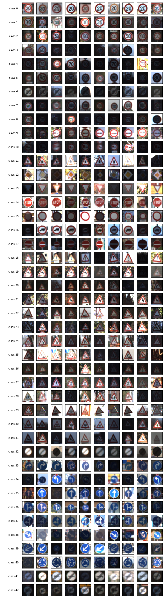

## Project: Traffic Sign Classification

Overview
---
In this project we train a convolutional neural network to solve a classic problem in self-driving cars - identifying traffic signs from images. We built our model on top of LeNet5 architecture and trained it using the [German Traffic Sign Dataset](http://benchmark.ini.rub.de/?section=gtsrb&subsection=dataset). We then test it using the testing data from the dataset as well as images from the internet that were shot unfiltered in the real world.

The code and data we used to achieve that can be found in this repository called *Traffic_Sign_Classifier.ipynb*

Dataset Exploration
---
The dataset is split into training data, validation data and testing data. Each example is composed of an traffic sign image and a label that describes the traffic sign class. The summary is as follows:
* training: 34799.0 - 67.13%
* validation: 4410 - 8.51%
* testing: 12630 - 24.36%
* total: 51839
* image dimensions: 32x32x3
* labels range: 0 - 42

The distribution of classes:
*   ClassId                                                         Name      Count      Percentage
*         0                                         Speed limit (20km/h)        270           0.52%
*         1                                         Speed limit (30km/h)       2940           5.67%
*         2                                         Speed limit (50km/h)       3000           5.79%
*         3                                         Speed limit (60km/h)       1860           3.59%
*         4                                         Speed limit (70km/h)       2640           5.09%
*         5                                         Speed limit (80km/h)       2490           4.80%
*         6                                  End of speed limit (80km/h)        570           1.10%
*         7                                        Speed limit (100km/h)       1890           3.65%
*         8                                        Speed limit (120km/h)       1860           3.59%
*         9                                                   No passing       1950           3.76%
*        10                 No passing for vehicles over 3.5 metric tons       2670           5.15%
*        11                        Right-of-way at the next intersection       1740           3.36%
*        12                                                Priority road       2790           5.38%
*        13                                                        Yield       2880           5.56%
*        14                                                         Stop       1050           2.03%
*        15                                                  No vehicles        840           1.62%
*        16                     Vehicles over 3.5 metric tons prohibited        570           1.10%
*        17                                                     No entry       1470           2.84%
*        18                                              General caution       1590           3.07%
*        19                                  Dangerous curve to the left        270           0.52%
*        20                                 Dangerous curve to the right        450           0.87%
*        21                                                 Double curve        420           0.81%
*        22                                                   Bumpy road        510           0.98%
*        23                                                Slippery road        660           1.27%
*        24                                    Road narrows on the right        360           0.69%
*        25                                                    Road work       1980           3.82%
*        26                                              Traffic signals        780           1.50%
*        27                                                  Pedestrians        300           0.58%
*        28                                            Children crossing        690           1.33%
*        29                                            Bicycles crossing        360           0.69%
*        30                                           Beware of ice/snow        600           1.16%
*        31                                        Wild animals crossing       1050           2.03%
*        32                          End of all speed and passing limits        300           0.58%
*        33                                             Turn right ahead        899           1.73%
*        34                                              Turn left ahead        540           1.04%
*        35                                                   Ahead only       1590           3.07%
*        36                                         Go straight or right        510           0.98%
*        37                                          Go straight or left        270           0.52%
*        38                                                   Keep right       2760           5.32%
*        39                                                    Keep left        390           0.75%
*        40                                         Roundabout mandatory        450           0.87%
*        41                                            End of no passing        300           0.58%
*        42           End of no passing by vehicles over 3.5 metric tons        330           0.64%

Exploratory Visualization
---

Preprocessing
---
By observing the dataset we see that color varies greatly within the same class due to lighting, so converting to grayscale helps the network identify the basic shape and not be distracted by lighting. Also in order to prevent the neural network from saturating due to large activation values, we make sure that the input data is centered at 0 and normalized to be width unity. The overall operations are: converting to grayscale using opencv's implementation of RGB to grayscale; secondly, we find the mean intensity of the entire training set and subtract the training data, validation data and testing data by the same mean value; finally we scale the color range which was originally 0 - 255 to 0 - 1.

Previously the only preprocessing was subtracting all data by the mean color of training set. Utiziling this method increased the validation set accuracy from 87% to 91%.

Model Architecture
---
Just like LeNet5 we have convolutional layers, relu activation layers, max pooling layers, linearizing layers and fully connected layers. By adjusting the depth of the convolution kernels from 6, 6, 16 to 25, 50, 100, I was able to obtain 93% accuracy. After adding the dropout layers and set keep probabilities accordingly the accuracy rose to ~98%. I experimented with removing max pooling layer and even an entire inception module but the accuracy remained.

So the final architecture is as follows:
* Input: Grayscale images of size 32x32x1
* Layer 1: Convolutional layer kernel size 5x5x1x25 with relu and dropout => 28x28x25
* Layer 2: Convolutional layer kernel size 5x5x25x50 with relu and dropout => 12x12x50
* Layer 3: Flattening layer of size 12 * 12 * 50 = 7200
* Layer 4: Fully connected layer of size 120
* Layer 5: Fully connected layer of size 84
* Layer 6: Fully connected layer of size 43
* Output: Softmax layer of 43

Model Training
---
I used the AdamOptimizer from Tensorflow to optimize the model.I also experimented with MomentumOptimizeer with momentum = 0.9 but the final accuracy dropped. Details of the training are:
* learning_rate = 0.001
* batch_size = 256
* epochs = 30

Other hyperparameters I used:
* keep rate for all dropout layers during training: 0.5
* keep rate for all dropout layers during validation and testing: 1.0
* network weight random gaussian initialization mu and sigma: 0, 0.1

Solution approach
---
I started with the LeNet5 architecture. I improved the validation accuracy step by step by adjusting image preprocessing methods, network layer parameters, training hyperparameters as I've previously mentioned. The final solution accuracies are:
* Validation accuracy: 97.6%.
* Test set accuracy: 96.0%

Acquiring new images
---
The images are randomly selected from google images and saved in ./new_images. They are named by their corresponding labels.
They are very clear representations of traffic signs, with the exception of 18.jpg and 28.jpg, where there are watermarks covering them.

Performance on new images
---
All images are classified correctly. The accuracy is 100%.

Model Certainty - Softmax Probabilities
---
The top 5 classification candidates for each image:

Image 16.jpg top 5 classes:
* For class 16: 100.00%
* For class 9: 0.00%
* For class 10: 0.00%
* For class 3: 0.00%
* For class 42: 0.00%

Image 1.jpg top 5 classes:
* For class 1: 99.99%
* For class 2: 0.01%
* For class 0: 0.00%
* For class 5: 0.00%
* For class 4: 0.00%

Image 18.jpg top 5 classes:
* For class 18: 100.00%
* For class 27: 0.00%
* For class 26: 0.00%
* For class 25: 0.00%
* For class 11: 0.00%

Image 28.jpg top 5 classes:
* For class 28: 99.97%
* For class 29: 0.02%
* For class 30: 0.01%
* For class 20: 0.01%
* For class 24: 0.00%

Image 14.jpg top 5 classes:
* For class 14: 100.00%
* For class 33: 0.00%
* For class 34: 0.00%
* For class 17: 0.00%
* For class 1: 0.00%

### Dependencies
This lab requires:

* [CarND Term1 Starter Kit](https://github.com/udacity/CarND-Term1-Starter-Kit)

The lab environment can be created with CarND Term1 Starter Kit. Click [here](https://github.com/udacity/CarND-Term1-Starter-Kit/blob/master/README.md) for the details.
